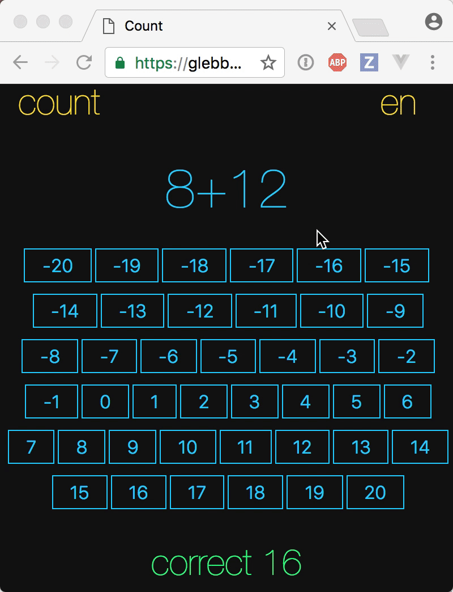

# count-app  

> Simple arithmetic game for children

## Details

- Deployed static page at [glebbahmutov.com/count-app/](https://glebbahmutov.com/count-app/)
- Source code at [github.com/bahmutov/count-app](https://github.com/bahmutov/count-app)
- Single [Hyperapp](https://hyperapp.js.org/) bundle in [dist/app.js](dist/app.js)
- [Cypress](https://www.cypress.io) end to end tests in [cypress/integration/spec.js](cypress/integration/spec.js)

MIT License

## More details

- my [blog posts about Hyperapp](https://glebbahmutov.com/blog/tags/hyperapp/)
- my [blog posts about Cypress](https://glebbahmutov.com/blog/tags/cypress/)
